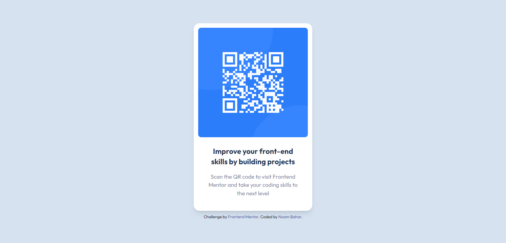

# Frontend Mentor - QR code component solution

This is a solution to the [QR code component challenge on Frontend Mentor](https://www.frontendmentor.io/challenges/qr-code-component-iux_sIO_H). Frontend Mentor challenges help you improve your coding skills by building realistic projects.

## Table of contents

- [Overview](#overview)
  - [Screenshot](#screenshot)
  - [Links](#links)
- [My process](#my-process)
  - [Built with](#built-with)
  - [Code snippet](#code-snippet)
  - [Useful resources](#useful-resources)
- [Author](#author)

## Overview

### Screenshots

Desktop view


Small mobile view (iPhone SE: 375 x 667 px)
<br />


### Links

- Solution URL: [GitHub repository](https://github.com/Noam-Bahar/qr-code-component-main)
- [Live Site URL](https://noam-bahar.github.io/qr-code-component-main/)

## My process

1. First, I initialized an empty Git repository, and downloaded the project template and files into the repository folder.
2. I installed TailwindCSS using the Tailwind CLI.
3. I created a figure element with the attached QR Code image and the text shown in the image in a figcaption element.

   - The figure element is used in conjunction with the figcaption element to mark up an image, illustration, or other secondary content with an optional caption.

4. Next, I inserted the required font family, and added the colors to the theme extension object in the Tailwind config file.
5. Now that everything is ready, I styled all the elements:

   - In order to center the page content, the **body** has the following styles: `  width: 100vw;  height: 100vh;  display: flex;  justify-content: center;  align-items: center;`

   - The **body** also has background color set to the required light gray, font family set to Outfit, and text align set to center.
   - The same flex settings were set in the **figure element**, as it also needs its content centered. The width was set to 20 rem. Padding, a shadow, and border radius were also set.
   - The **figure caption** also has its content centered, in order to add a gap between the title and subtitle. It also has a padding.
   - The **title**'s font weight was set to bold, the font size was set to `text-xl`, and color was set to dark blue. The **subtitle**'s font size was set to 15 pixels (as required) and the color was set to grayish blue.

6. Finally, I deployed the website on GitHub Pages.

### Built with

- [TailwindCSS](https://tailwindcss.com/) - For styles
- Semantic HTML5 markup

### Code snippet

This is the QR code component:

```html
<figure
  class="bg-white shadow-lg w-80 p-3 rounded-2xl flex flex-col justify-center items-center"
>
  
  <figcaption class="p-6 flex flex-col justify-center items-center gap-4">
    <h1 class="font-bold text-xl text-darkBlue">
      Improve your front-end skills by building projects
    </h1>
    <p class="text-[15px] text-grayishBlue">
      Scan the QR code to visit Frontend Mentor and take your coding skills to
      the next level
    </p>
  </figcaption>
</figure>
```

### Useful resources

- [TailwindCSS Documentations](https://tailwindcss.com/docs) - The TailwindCSS documentation is very helpful, and I always turn to their website for help in Tailwind.

## Author

- GitHub - [Noam Bahar](https://github.com/Noam-Bahar)
- Frontend Mentor - [@Noam-Bahar](https://www.frontendmentor.io/profile/Noam-Bahar)
